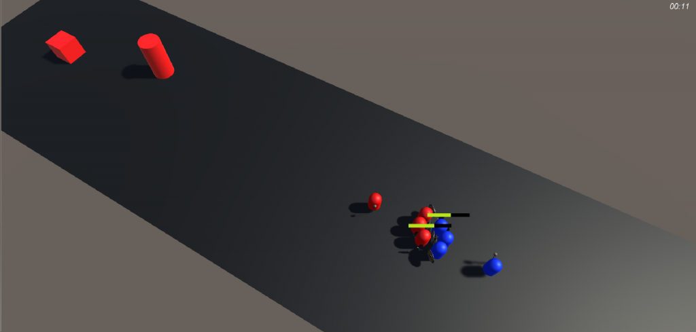

# UnityMOBA
UnityMOBA is a MOBA engine in Unity. This is the playground of my experimentations on the creation of a multiplayer game architecture. My goal here is to create an architecture that allows an easy high-level creation of new features.

## Features available
Here are the features that are currently available :
- CQ/Distance minions walk and fight on lanes
- Barracks that spawn minions
- Towers that attack every enemy in sight

## Future development
Here are my main next goals to accomplish :
- Implement a basic communication between a client and the server
- Create the client character
- Adding Cores to destroy and win a game

